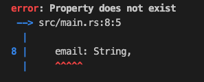
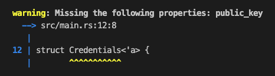
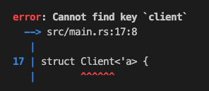

# Validate fields macro

Compile-time checks in Rust to validate struct fields against configurations in `application.yml`. Not to be used in production!

* Checks if a struct property exists in the YAML file
* Checks if a YAML mapping exists in the struct
* Checks for missing properties
* Checks for properties up to 2 levels deep only

Based on https://tinkering.xyz/introduction-to-proc-macros.

---

## Install

Add the following in `Cargo.toml`.

```bash
[dependencies]
validate_fields_macro = { git = "https://github.com/remykarem/validate-fields-macro" }
```

We are using the `proc_macro_diagnostic` feature, which is only available via the `nightly` release channel. Create a file named `rust-toolchain` and add the following:

```txt
nightly
```

## Usage

Define `application.yml`.

```yml
person:
  name: me
  age: 30

credentials:
  private_key: this_is_some_private_key
  public_key: this_is_some_public_key
```

Define the structs in `src/main.rs`.

```rust
use validate_fields_macro::validate_fields;

#[validate_fields]
struct Person {
    name: String,
    age: u8,
    email: String,
}
```



```rust
use validate_fields_macro::validate_fields;

#[validate_fields]
struct Credentials<'a> {
    private_key: &'a str,
}
```



```rust
use validate_fields_macro::validate_fields;

#[validate_fields]
struct Client<'a> {
    url: &'a str,
    path: &'a str,
}
```


